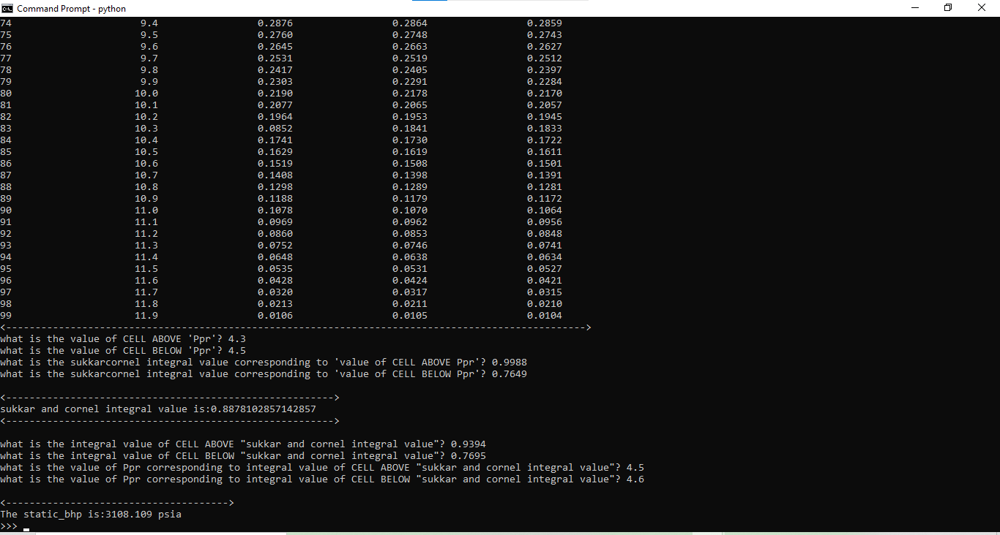

# Portfolio Project :fire:

## Description :house:

This is my portfolio project at the end of the foundation phase in the ROADMAP to becoming a software engineer.
In this project, I discovered a pressing need amongst the natural gas engineering students and that was calculating static bottom hole pressure of a gas well. So, I took it upon myself to come up with a kind of desktop application that can answer this need but using the SUKKAR and CORNELL integral method. This will be a very user friendly, light weight application. 

<h2>_Stick up for updates!_<h2/>

## _installation_

Just like any other Python package, it can install by simply running the command below on your terminal or command prompt:

- **_pip install static-bhp_**

## Dependencies

This package requires:

**_Python (>= 3.9)_**

**_numpy==1.23.2_**

**_pandas==1.4.3_**

## <h2>Usage</h2>:

- First meet the requirements in the _dependencies_.
- Open your terminal or command prompt and pip install the package using the command **_pip install static-bhp_**.
- Import the package as follows:
  - from static_bhp import static_bhp
  - Fill in the data required
  - Read and follow the instructions carefully
  - Supply the values from the sukkar and cornell integral table provided
  - The static bottom hole pressure of the gas will be displayed after you have supplied all the data.

## Overview of package

## Files :pencil:

| file                     | Description                                                       |
| ------------------------ | ----------------------------------------------------------------- |
| physical_properties      | Folder containing modules for the physical properties of gas well |
| staticbhp.py             | module that calculates static bottom hole pressure of gas well    |
| sukkarcornelintegral.csv | A table containing integral constants at certain Tpr and Ppr      |

## Author

- Github: [betiniakarandut](https://www.github.com/betiniakarandut)
- LinkedIn: [betini-akarandut](https://www.linkedin.com/in/betini-akarandut-24654321a)
- Tweeter: [@betiniakarandut](https://twitter.com/betiniakarandut)
- alx-Holberton Student
